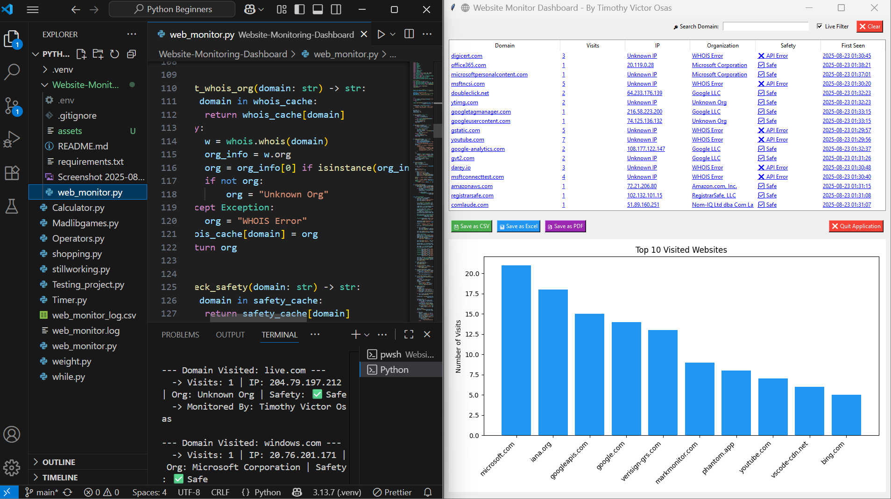
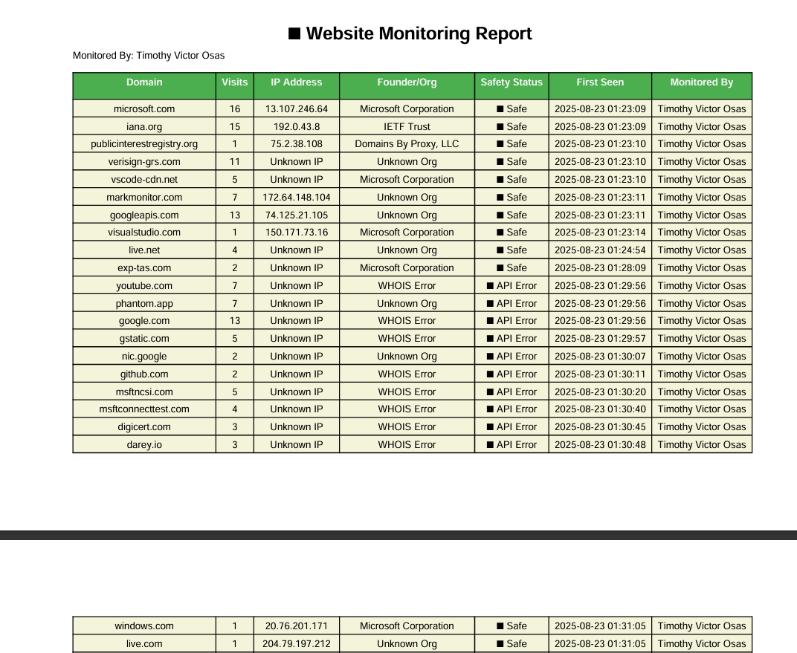

```markdown
# 🌐 Website Monitoring Dashboard

A real-time **website monitoring tool** with a **graphical dashboard** for visualizing and analyzing domain activity.  
It captures DNS requests, logs data into CSV, displays results in a searchable Treeview, and generates reports in PDF format.

---

## 🚀 Features

- 🔍 **Real-time DNS Monitoring** – tracks domains accessed from your system.
- 📊 **Interactive Dashboard** – displays domains in a searchable Treeview.
- 📈 **Bar Chart Visualization** – live chart showing domain frequency (updates with search filter).
- 📄 **Report Export** – save monitoring results as PDF reports.
- 📝 **Log Management** – auto-logs results to `.csv` and `.log` files.
- 🎯 **Search & Filter** – quickly search for domains and update the chart dynamically.

---

## 📂 Project Structure
```

Website-Monitoring-Dashboard/
│── web_monitor.py # Main project file
│── web_monitor_log.csv # Auto-generated CSV logs
│── web_monitor.log # Auto-generated log file
│── requirements.txt # Dependencies
│── README.md # Project documentation

````

---

## 🛠️ Installation

1. **Clone this repository**
   ```bash
   git clone https://github.com/Osvic1/Website-Monitoring-Dashboard.git
   cd Website-Monitoring-Dashboard
````

2. **Create and activate a virtual environment (recommended)**

   ```bash
   python -m venv .venv
   source .venv/bin/activate   # Linux/Mac
   .venv\Scripts\activate      # Windows
   ```

3. **Install dependencies**

   ```bash
   pip install -r requirements.txt
   ```

---

## ▶️ Usage

Run the project with:

```bash
python web_monitor.py
```

- The dashboard will launch automatically.
- Use the **search bar** to filter domains.
- The **bar chart** updates dynamically with filtered results.
- Export reports as **PDF** for sharing.

---

## 📊 Example Dashboard


---

## 📑 Requirements

Dependencies are listed in **requirements.txt**:

- tkinter
- pandas
- matplotlib
- pydivert
- reportlab

---

## 💡 Future Improvements

- Add email/SMS alerts for suspicious domains
- Support for multiple users and network-wide monitoring
- Deploy as a web app (Flask/Django + React)

---

## 👤 Author

**Timothy Victor Osas**

- 📧 Email: [Timothyv952@gmail.com](mailto:Timothyv952@gmail.com)
- 🌐 Portfolio: [Coming Soon](#)
- 💼 LinkedIn: [https://www.linkedin.com/in/timothy-victor-a61421223/](https://www.linkedin.com/in/timothy-victor-a61421223/)
- 🐙 GitHub: [https://github.com/Osvic1](https://github.com/Osvic1)

---

## 📜 License

This project is open-source and available under the [MIT License](LICENSE).

```
## 📊 Example Dashboard

| Dashboard | Live Report | PDF Report |
|:---:|:---:|:---:|
|  |  |  |

```
