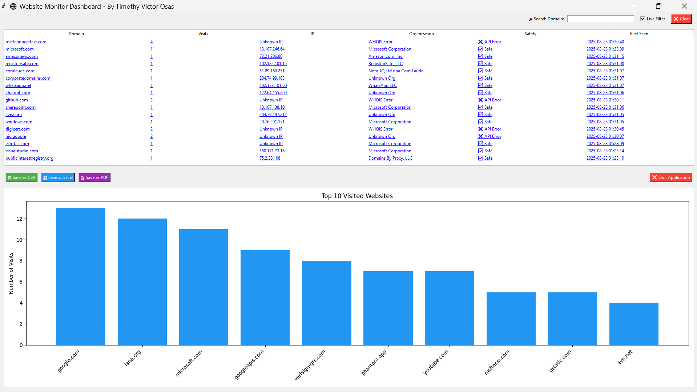

```markdown
# 🌐 Website Monitoring Dashboard

A real-time **website monitoring and analysis tool** with a **graphical dashboard** for visualizing, logging, and reporting network activity.  
It captures DNS traffic, extracts website information, checks safety with Google Safe Browsing, and generates professional reports.

---

## 🚀 Features

- 🔍 **Real-time DNS Monitoring** – tracks domains visited on your system using Scapy.
- 🌍 **Domain Insights** – resolves:
  - IP Address
  - Organization (WHOIS lookup)
  - Safety Status (Google Safe Browsing API)
  - Timestamps (First Seen & Last Seen)
- 📊 **Interactive Dashboard** – displays domains in a searchable Treeview with clickable links.
- 📈 **Bar Chart Visualization** – top visited websites shown dynamically with filtering support.
- 📄 **Export Reports**:
  - Save results as **CSV**
  - Export to **Excel**
  - Generate formatted **PDF reports**
- 📝 **Log Management** – auto-logs results to `.csv` and `.log` files.
- 🎯 **Search & Filter** – live filtering of domains with optional manual search.
- 🔗 **Clickable Domains** – open domains directly from the dashboard with a double-click.
- 🛡 **Security Insights** – integrates Google Safe Browsing API to flag malicious domains.

---

## 📂 Project Structure
```

Website-Monitoring-Dashboard/
│── web_monitor.py # Main project file
│── web_monitor_log.csv # Auto-generated CSV logs
│── web_monitor.log # Auto-generated log file
│── requirements.txt # Dependencies
│── README.md # Project documentation
│── assets/ # Dashboard & report screenshots

````

---

## 🛠 Installation

1. **Clone this repository**
   ```bash
   git clone https://github.com/Osvic1/Website-Monitoring-Dashboard.git
   cd Website-Monitoring-Dashboard
````

2. **Create and activate a virtual environment (recommended)**

   ```bash
   python -m venv .venv
   source .venv/bin/activate   # Linux/Mac
   .venv\Scripts\activate      # Windows
   ```

3. **Install dependencies**

   ```bash
   pip install -r requirements.txt
   ```

4. **Set your Google Safe Browsing API Key**

   - Create a `.env` file in the project folder:

     ```
     GOOGLE_API_KEY=your_api_key_here
     ```

---

## ▶ Usage

Run the project with:

```bash
python web_monitor.py
```

- The dashboard will launch automatically.
- Use the **search bar** to filter domains.
- The **bar chart** updates dynamically with results.
- Double-click on any domain to open it in your browser.
- Export reports as **CSV, Excel, or PDF**.

---

## 📊 Example Dashboard



---

## 📑 Requirements

Dependencies are listed in **requirements.txt**:

- scapy
- tldextract
- python-whois
- requests
- pandas
- matplotlib
- reportlab
- tkinter (standard with Python)
- python-dotenv

---

## 💡 Future Improvements

- Add email/SMS alerts for suspicious domains.
- Support for multiple users and network-wide monitoring.
- Deploy as a web app (Flask/Django + React).
- Add database support (SQLite/PostgreSQL).

---

## 👤 Author

**Timothy Victor Osas**

- 📧 Email: [Timothyv952@gmail.com](mailto:Timothyv952@gmail.com)
- 💼 LinkedIn: [https://www.linkedin.com/in/timothy-victor-a61421223/](https://www.linkedin.com/in/timothy-victor-a61421223/)
- 🐙 GitHub: [https://github.com/Osvic1](https://github.com/Osvic1)

---

## 📜 License

This project is open-source and available under the [MIT License](LICENSE).

---

### 📊 Example Reports

|                          Overview                           |                  Live Monitoring                   |                     PDF Report                      |
| :---------------------------------------------------------: | :------------------------------------------------: | :-------------------------------------------------: |
|  |  |  |

```

```
